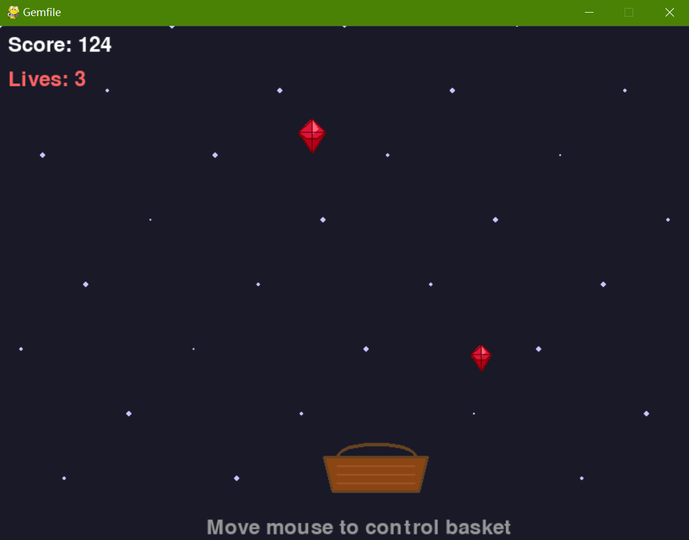

# Gemfile, But It's a Python Game! 🎮💎

> A hilarious April Fools' Day prank that turns a Ruby dependency file into a fun Python game.



## 🎯 Description

This is a clever April Fools' Day project that masquerades as a Ruby `Gemfile` but is actually a fully functional Python game! Players control a basket to catch falling gems, trying to prevent gems from falling off the screen. The game ends on running out of lives.

Latest Update on April 8th 2026: Added looping background music known as "Sky Temple Zone" (from Sonic Superstars, 16-bit version) as in `main_theme.mp3`, but sound effects aren't included.

**The joke:** When developers see a file named "Gemfile" in a repository, they expect Ruby dependency declarations. Instead, they get a fun Python game! 😄

## 🤣 The April Fools' Day Prank

This project is designed to be a harmless, fun prank for developers:

1. Clone or download the repository on April 1st:
```bash
git clone https://github.com/Pac-Dessert1436/gemfile-as-a-python-game.git
cd gemfile-as-a-python-game
```
2. Watch as fellow developers try to figure out why the "Gemfile" is causing errors
3. Reveal the joke by showing them how to actually run the game!

## 🚀 Quick Start

### Prerequisites
- [Python 3.6+](https://www.python.org/downloads/)
- pip (Python package manager)

### Installation & Gameplay

1. **Install dependencies:**
   ```bash
   pip install pygame
   ```

2. **Run the game (choose your preferred method):**

   **Method 1 - The Prank (Recommended for April Fools' Day):**
   ```bash
   python Gemfile
   ```
   *This is the whole joke - running a Python file named "Gemfile"!*

   **Method 2 - Normal execution:**
   ```bash
   python -c "from os import rename; rename('Gemfile', 'gemfile.py')"
   python gemfile.py
   ```

3. **Game Controls:**
   - **Mouse Hover**: Move basket left or right
   - **Spacebar**: Restart game on game over
   - **ESC**: Quit game

## 🎮 Game Features

- Catch falling gems to score points
- Avoid dropping gems to preserve lives
- Particle effects for visual appeal
- Smooth controls and animations
- Background music loop (no sound effects)
- Perfect April Fools' Day surprise!

## 📁 Project Structure

```
gemfile-as-a-python-game/
├── Gemfile          # The actual Python game (the prank!)
├── README.md        # This file
├── screenshot.png   # Game screenshot
└── LICENSE          # MIT License
```

## 🛠️ Technical Details

- Built with **Pygame** for graphics and game logic
- Object-oriented design with classes for particles and gems
- Smooth animation and collision detection
- Cross-platform compatibility

## 📄 License

This project is licensed under the MIT License. See the [LICENSE](LICENSE) file for details.

---

Happy April Fools' Day! Remember, the best pranks are the ones that make everyone smile. 😊